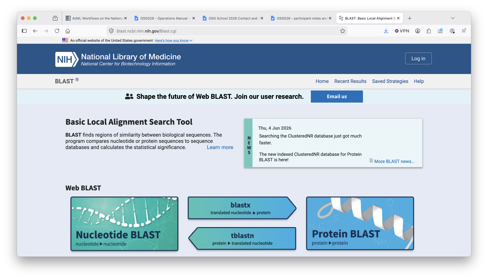
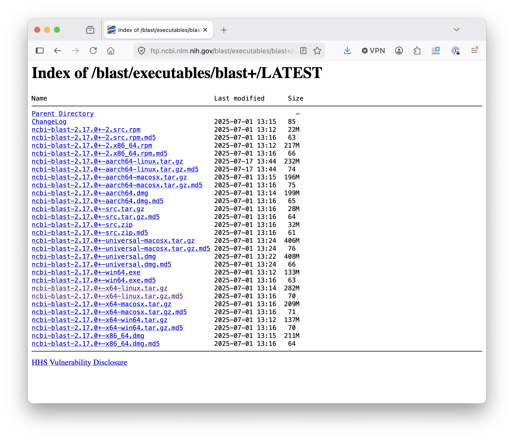

<style type="text/css"> pre em { font-style: normal; background-color: yellow; } pre strong { font-style: normal; font-weight: bold; color: \#008; } </style>

Software Exercise 2.5: Example of manual installation
===================================================

**Objective**: Identify all the steps need to add software to a container, when 
the software does *not* have a standard "managed" install process. 

**Why learn this?**: Some software is only available through downloading files and 
adding them to a system manually. This is the approach of last resort - if you can 
use a package manager or other tool for the installation - do that first! 

Our software example
--------------------

The software we will be using for this example is a common tool for
aligning genome and protein sequences against a
reference database, the BLAST program. In this case, we're interested 
specifically in the `blastp` program. 

Finding files for installation
---------------------------

1.  Search the internet for the BLAST software.  Searches might include
"blast bioinformatics executable or "download blast software".  Hopefully these
searches will lead you to a BLAST website page that looks like this:

    

    Note that the URL for this webpage starts with `blast.ncbi.nlm.nih.gov`.

    !!! warning "Check your sources!"
        You should always be careful downloading software from the internet!
        Only download software from a trusted source and be on the lookout for
        forfeits.

        Feel free to ask a facilitator if you are not sure if you can trust a software source.

1.  Click on the title that says ["Download
BLAST"](files/blast-landing-dl.png) and then look for the
link that has the [latest installation and source
code](files/blast-download-landing2.png).  

1. You should end up on a page with a list of each version of BLAST that is available for
different operating systems.

	

	We could download the source and compile it ourselves, but instead,
we're going to use one of the pre-built binaries.  **Before proceeding,
look at the list of downloads and try to determine which one you want.**

1.  Based on our operating system, we want to use the Linux binary,
which is labelled with the `x64-linux` suffix. **Right click on the filename
and then click "Copy link address".**
	
1. On the Access Point, create a directory for
this exercise. Then download the appropriate `tar.gz` file and un-tar/decompress it
it. If you want to do this all from the command line, the sequence will 
look like this (using `wget` as the download command.) **Use the link you copied from
the previous step.**

        :::console
        $ wget https://ftp.ncbi.nlm.nih.gov/blast/executables/blast+/LATEST/ncbi-blast-2.17.0+-x64-linux.tar.gz
        $ tar -xzf ncbi-blast-2.17.0+-x64-linux.tar.gz

1.  We're going to be using the `blastp` binary in our job. Where is it
in the directory you just decompressed?

Adding BLAST to a container
------------------

Now the fun begins! To add `blastp` to a container, we need to: 

1. Choose a base image.
1. Copy the blast files we downloaded into the container.
1. Unzip them (if needed) in a particular location.
1. Provide information about blast's location to the command line.

### Choose a base image

We'll use a base image that has a lot of basic packages installed, to make 
life easier later. The OSG team has created an `ubuntu` container with what we 
need: 

```
Bootstrap: docker
From: hub.opensciencegrid.org/htc/ubuntu:24.04
```

### Include the files

1. Look at [Exercise 2.4](part2-ex4-apptainer-definition.md). Which section of 
the definition file is needed to copy the downloaded `tar.gz` file into the container? 
1. One convention is to put manual software installs in the `/opt` directory. What 
would that look like in the definition file? 
1. Try writing the section of the definition file that copies in the blast files. 

You should have something like the following to add to your definition file: 

```
%files
 ncbi-blast-2.17.0+-x64-linux.tar.gz /opt
```

### Unzip in a certain location

1. Look at [Exercise 2.4](part2-ex4-apptainer-definition.md). Which section of 
the definition file should run the commands to unzip the `tar.gz` file? 
1. Where did we put the `tar.gz` file in the previous step? What command would 
we need to run first, because we can unzip? 
1. Try writing the section of the definition file that unzips the blast files. 

You should have something like the following to add to your definition file: 

```
%post
 cd opt/
 tar -xzf ncbi-blast-2.17.0+-x64-linux.tar.gz 
```

### Provide information about location

1. Finally - can you write out the folder path in the container that contains the actual blast 
executable files? 
1. If you're not sure, look at the folder that you unzipped in the first part 
of this exercise. 
1. What command would add the executable folder to the system `PATH` variable? 
1. Try writing the section of the definition file that set this variable: 

You should have something like the following to add to your definition file: 

```
%environment
 export PATH=/opt/ncbi-blast-2.17.0+/bin/:$PATH
```

### Build and test

The entire definition file should look like this: 

```
Bootstrap: docker
From: hub.opensciencegrid.org/htc/ubuntu:24.04

%files
 ncbi-blast-2.17.0+-x64-linux.tar.gz /opt

%post
 cd opt/
 tar -xzf ncbi-blast-2.17.0+-x64-linux.tar.gz 

%environment
 export PATH=/opt/ncbi-blast-2.17.0+/bin/:$PATH
```

Build and test as described in [Exercise 1.4](part1-ex4-apptainer-build.md#build-the-container)

Apply to Your Work
------------------

1. Is the software you want to use available as a standalone binary, like `blastp`?
   How could you find out, and where could you get the necessary file?

2. How could you adapt a definition file to include a binary executable file?
