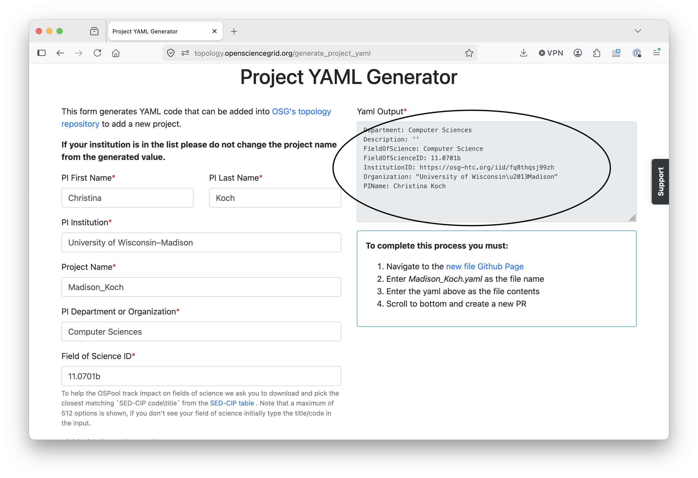

# Continue Your Access to the OSPool

Any U.S.-based researcher with an academic affiliation can use the OSPool indefinitely, with no allocation or cost to you. 

1. [For anyone at a US academic or research institution](#for-any-us-academic)
1. [For UW - Madison CHTC users](#for-uw-madison-chtc-users)

## For any US academic

You can continue your access to the OSPool after the School by requesting to join 
a long-term project affiliated with your PI. There are two ways to do this: 

### Option 1: Schedule a consultation at the School (preferred)

To continue using your account beyond the School, talk to School staff during the 
"project creation" sessions on Thursday and Friday. Information on these sessions
will be provided at the School or via Slack.

During the consultation, we will have you contact your PI and provide project details 
to us. Once that process is complete, you will be added to a long-term OSPool project 
and be able to use the OSPool after the School. 

### Option 2: Submit an application after the School

If you are unable to meet with us during the School or decide to continue your access at a later date, complete the following steps by August 15: 

1. Go to this link: [Project Creation Form](https://topology.opensciencegrid.org/generate_project_yaml)
1. Fill out the form.

    !!! note
	    If the Project Name doesn't auto-populate, use `OSG_School_2026`. 
	
1. After completing the form, click "Submit manually": 

1. Send an email to [support@osg-htc.org](mailto:support@osg-htc.org) with the following: 

    1. Include the text of the project creation form (see image below). 

	

    1. CC the PI of your research group, asking them to confirm your membership. 
	in their group. If you are the PI, that should be indicated in 
	the email. 

1. If you are not the PI of your research group, make sure your PI replies to 
your email to confirm that you are working with them!!

Once the project PI has confirmed your membership, OSG Facilitators will create a new 
project of the form `Institution_PIName`. You will receive
a notification when you are added to the new project, and a follow up email from 
the OSG facilitation team. 

## For UW-Madison CHTC Users

If you have a CHTC account, you can access the OSPool from CHTC; you don't need a 
specific "OSPool project."

Learn about using the OSPool from CHTC here: [Scale Beyond Local HTC Capacity](https://chtc.cs.wisc.edu/uw-research-computing/scaling-htc#how-to-use-external-capacity)

If you'd like to use the OSPool independently of your CHTC account, talk to 
a facilitator about your use case. 
